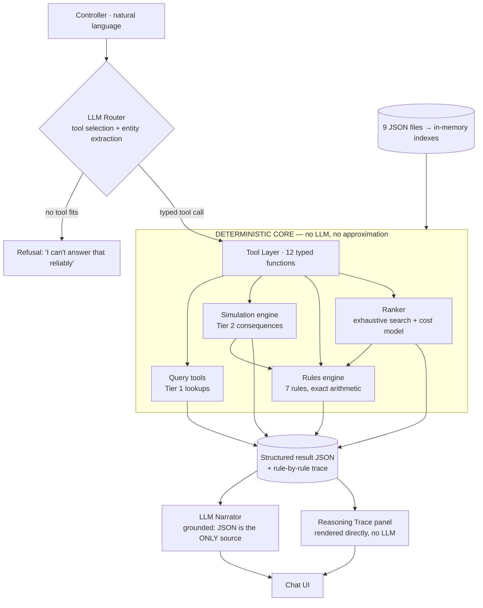

# Crew Ops Advisor — Execution Plan

Built and verified against the actual dataset you uploaded. Every number in this plan
was reproduced from `data/` before it was written down.

---

## 1. The decision that decides your score

The rubric puts 20% on **AI Utilization** and the problem statement names the real
question outright: *what should the LLM do and what should deterministic code do?*

**Your answer, and defend it hard in the deck:**

> The LLM is a **translator and a narrator**. It never computes.
> A deterministic rules engine is the **only** source of truth for legality, cost and ranking.

Concretely, the LLM does exactly three jobs:

| # | Job | Input | Output |
|---|---|---|---|
| 1 | **Route** — turn English into a typed tool call | user message + tool schemas | `check_assignment(crew_id="C-2087", pairing_id="P-2291")` |
| 2 | **Narrate** — turn the engine's JSON into controller-readable prose | engine JSON *only* | "C-2087 would exceed the 7-day duty limit by 1h20m on 15 Sep." |
| 3 | **Refuse** — say so when no tool fits | user message | "I can't answer that reliably from the data I have." |

Every number the controller sees originates in Python, not in a token. Say this
sentence in the demo — it is the single highest-scoring sentence you can say.

---

## 2. Architecture



Two rules that make this defensible:

1. **The narrator prompt receives the JSON and nothing else.** No dataset in context.
   It physically cannot invent a crew ID it wasn't handed.
2. **The Reasoning Trace panel bypasses the LLM entirely.** Rule ID, the numbers,
   the limit, pass/fail — rendered straight from the engine. If the narrator ever
   drifts, the trace still shows the truth. That is your explainability story.

---

## 3. Tech stack — pick these, don't deliberate

| Layer | Choice | Why |
|---|---|---|
| Language | **Python 3.11** | Your strength; the whole ecosystem is here |
| Data | **In-memory dicts + indexes** (`app/data.py`) | 147 flights / 150 crew. SQLite adds a query surface the LLM can get *wrong*. Load once at startup, ~5 ms. Mention SQLite as your scale answer. |
| Rules | **Pure Python dataclasses** | Every check returns a `RuleResult` — this *is* the explainability layer |
| LLM | **Claude (Sonnet 4.6) native tool-calling** | No LangChain. Frameworks cost you 3 hours and hide the boundary you're being scored on. Raw `/v1/messages` with `tools=[...]` is ~80 lines. |
| UI | **Streamlit** | Python-native chat, `st.expander` for the trace, zero frontend time. A React SPA is not worth 6 hours here. |
| Eval | **Custom harness over `questions.json` + `scenarios.json`** | Your biggest differentiator — see §8 |
| Deploy | **Local, `streamlit run`** | The brief explicitly says don't spend hours on infra |

**Do not use:** LangChain, LlamaIndex, a vector DB, RAG, or an optimisation solver.
RAG over 9 small JSON files is the mistake the brief is warning you about — it's
"decorating a lookup," which is literally the AI Utilization failure mode.

---

## 4. Repo layout

```
crew-ops-advisor/
├── data/                  # the 9 JSON files, unchanged
├── app/
│   ├── data.py            # loader + indexes            ✅ BUILT & VERIFIED
│   ├── rules.py           # 7 rules, exact arithmetic   ✅ BUILT & VERIFIED
│   ├── simulate.py        # Tier-2 consequence engine   ✅ BUILT & VERIFIED
│   ├── recommend.py       # Tier-3 ranking + costs      ✅ BUILT & VERIFIED
│   ├── tools.py           # 12 tool schemas + dispatch  ← you build (§6)
│   ├── agent.py           # router + narrator + refusal ← you build (§7)
│   └── ui.py              # Streamlit chat              ← you build
├── eval/
│   └── run_eval.py        # scores against answer keys  ← you build (§8)
├── docs/
│   ├── architecture.md    # the mermaid above
│   └── failure_analysis.md
└── README.md
```

The four ✅ files are attached and already reproduce every published answer key.
That is roughly 8 hours of the hardest work, done and checked.

---

## 5. Dataset traps — these will sink other teams

I found these by running the engine against the answer keys. Each one produces a
*fluent, confident, wrong* answer if you miss it.

| # | Trap | What's actually true |
|---|---|---|
| 1 | **`certifications.valid_from` is garbage** | Licence records carry future or inverted issue dates (C-1042: valid_from 2030-01-24). Only `valid_to` is operative for RULE-CERT-06. Enforce `valid_from` and you'll flag all 150 crew as illegal. |
| 2 | **RULE-REST-04 is bidirectional** | You must check rest against the crew's **next rostered duty**, not just `last_rest_ended`. Q28 (C-5837) is *only* catchable this way: 10h45m before P-2204 on 17 Sep. Miss it and your Tier-3 ranking recommends an illegal crew. |
| 3 | **`last_rest_ended` means rest has ENDED** | It's an availability timestamp, not the start of a countdown. Don't add 12h to it. |
| 4 | **7d/28d windows are calendar-day, inclusive of the duty date** | Sum `daily_history` for the window ending on the duty date, then add the proposed duty. Use `daily_history`, never the `duty_hours_7d` summary field — that's pinned to the 14 Sep snapshot and silently wrong on any other day. |
| 5 | **Future rostered duties aren't in `daily_history`** | History ends 2026-09-14. For window sums on 15–20 Sep you must merge three sources: proposed duty → existing future roster → history. Exclude the pairing being vacated. |
| 6 | **Deadhead is only documented DEL→BLR** | DX402 (arr 08:45Z, odd dates) / DX589 (arr 07:45Z, even). New report = arrival + 15 min. Anything else: say "not modelled" rather than invent a connection. |
| 7 | **Reserve window is tested against report time** | Not the callout time, not the wall clock. C-3305's 00:00–05:30 window vs a 06:00 report is a real exclusion. |

Facts the verified engine reproduces exactly:
`C-2087` → DUTY-02 breach 1h20m (61.33h) on 15 Sep and 1h05m (61.08h) on 16 Sep ·
`C-3305` → legal day 1 alone, 8h15m over (68.25h) on day 2 ·
`C-3310` → clean, ₹18,500 ·
`C-2210` → legal via deadhead, ₹41,200, 3h delay ·
`C-2091` → RULE-QUAL-05 (ATR72 only) ·
`C-5837` → RULE-REST-04 downstream ·
`C-5417` → RULE-CERT-06 on 19 Sep ·
BLR closure 17 Sep → 13 legs, exact set match ·
VT-DXA +90 min on 16 Sep → FDP 12.75h vs 12.0h limit.

---

## 6. The tool contract

Twelve tools. Small, typed, composable. This list *is* your architecture — put it on a slide.

**Tier 1 — retrieval**
```
get_crew(crew_id)                          → profile + clocks + certs + risk
find_crew(base?, rank?, rating?, status?)  → filtered roster
get_flights(date?, dep?, arr?, flight_no?) → schedule slice
get_pairing(pairing_id | crew_id, date?)   → pairing + complement + report/release
get_duty_clock(crew_id, as_of_date)        → 7d/28d totals with per-day contributions
get_reserves(base, date)                   → reserve pool + on-call windows
list_expiring_certs(as_of_date, within_days)
get_risk_signal(crew_id)
```

**Tier 2 — consequence**
```
simulate_sick(crew_id, dates?)                       → uncovered flights, pax, pairings
simulate_station_closure(station, date, start, end)  → affected legs + pairings
simulate_delay(pairing_id, date, delay_hours)        → FDP after delay vs limit
check_assignment(crew_id, pairing_id, dates?, deadhead?)
        → {legal, issues[], rules_checked[], checks[] with every number}
```

**Tier 3 — recommendation**
```
rank_options(pairing_id, role, dates?, exclude?)
        → ranked legal options w/ cost + delay + reasoning, rejected list, cancel fallback
draft_notification(crew_id, pairing_id)   → templated, engine-filled; LLM polishes tone only
```

Design notes worth saying out loud to judges:

- **No free-form SQL tool.** Fixed signatures mean the LLM cannot express a wrong query.
  That's a deliberate correctness/flexibility trade.
- `check_assignment` returns the **full per-rule trace**, not a boolean. The trace is the product.
- `rank_options` also returns **`rejected`** — the near-misses with their reasons. A controller
  asking "why not C-2087?" is the most common real follow-up.
- Multi-tool chaining handles Tier 3 naturally: `simulate_sick` → `rank_options` → `draft_notification`.

---

## 7. Prompt design

**Router system prompt** (short, strict):
> You are a tool router for an airline Crew Control desk. Convert the controller's
> message into one or more tool calls. Today is 2026-09-14T18:00Z; the schedule covers
> 14–20 Sep 2026. Never compute duty hours, legality, or cost yourself — the tools do that.
> If no tool answers the question, call `cannot_answer` with the reason. Resolve relative
> dates ("tomorrow" → 2026-09-15) before calling.

**Narrator system prompt** (this one earns the marks):
> You are explaining a Crew Control decision to an experienced controller.
> You are given a JSON result from a deterministic rules engine. **Every fact in your
> answer must appear in that JSON.** Do not add crew, flights, costs or hours that are
> not present. Do not round or recompute any number — quote them exactly.
> Lead with the answer. Then give the reason, citing rule IDs. Be terse; the controller
> is under time pressure. If `legal` is false, say so in the first sentence.

Add a **cheap grounding check** before rendering: regex every `C-\d{4}`, `DX\d{3}`,
`RULE-[A-Z]+-\d{2}` and `₹` figure out of the narration and assert each appears in the
source JSON. If one doesn't, drop back to rendering the trace table with no prose.
This is ~15 lines and it means you can honestly say **"we cannot hallucinate a crew ID."**

**Refusal path.** Ship at least two questions the system declines — the brief says
saying "I can't answer that reliably" scores *higher* than a wrong answer. Good candidates:
anything needing passenger connections, crew pay rules, or weather beyond the closure event.

---

## 8. The eval harness — your unfair advantage

`questions.json` has 38 questions with expected answers. `scenarios.json` has 6 with keys.
Nobody else will build this, and it turns your demo from a claim into a number.

```python
# eval/run_eval.py
# For each question: route → dispatch → compare to expected_answer
#   Tier 1: exact match on sets/values
#   Tier 2: legal flag + issue rule IDs + the numeric margins
#   Tier 3: rank-1 crew_id and cost match; tie-groups by cost count as equal
# Emit: overall %, per-tier %, per-question pass/fail, and a diff for each failure.
```

Two things this buys you:

1. **A slide that says "34/38, 100% Tier 1, 93% Tier 2, 75% Tier 3."** Every other team
   will say "it works well." One of you has evidence.
2. It catches regressions in the last four hours, when you are tired and changing things.

Note on ties: the answer keys sort equal-cost options by crew_id; my ranker sorts by
reachability. The README explicitly says equal-cost plans are equally correct — so
compare **cost tiers**, not exact ordering. Mention this in the README as a considered
choice, not a bug.

---

## 9. Hour-by-hour plan

Assumes ~24 working hours and a 4-person team. Compress proportionally if shorter.

| Hours | Workstream | Owner | Done when |
|---|---|---|---|
| 0–1 | Repo, venv, data load, **run `validate.py`**, drop in the 4 built modules, smoke-test | All | `check_assignment("C-2087","P-2291")` returns the 1h20m breach |
| 1–3 | `tools.py` — 12 schemas + dispatch table | Eng A | Every tool callable from a Python REPL |
| 1–4 | `eval/run_eval.py` scaffold, all 38 questions loaded, Tier-1 comparators | Eng B | Tier 1 scoring runs end-to-end |
| 3–6 | `agent.py` — router loop, multi-tool chaining, `cannot_answer` | Eng A | 10 Tier-1 questions answered in chat |
| 4–7 | Streamlit UI: chat, answer, **Reasoning Trace expander**, rule table, timing badge | Eng C | Trace renders every rule with numbers |
| 3–7 | Deck outline + architecture diagram + failure-case hunt | Eng D | Diagram done, boundary slide drafted |
| 7–10 | Narrator prompt + grounding check; Tier-2 questions through the full loop | A + B | Q17–Q30 answered, eval green |
| 10–13 | Tier 3: `rank_options` wired, cost/delay display, `draft_notification` | A + C | Q31/Q36/Q37 demo-clean |
| 13–15 | **Eval sweep + fix the top 3 failures** | B | Score board printable |
| 15–17 | Multi-turn context ("what about C-2210?"), proactive morning-briefing panel (Q38) | C | Follow-up questions resolve pronouns |
| 17–19 | README: setup, trade-offs, limitations, PII section, scalability section | D | Checklist §8 of the brief fully ticked |
| 19–21 | `docs/failure_analysis.md` + rehearse the demo **three times** with a timer | All | Demo under 5 min, no dead air |
| 21–23 | Held-out robustness: paraphrase 10 questions, weird dates, unknown crew IDs | B + C | Graceful refusals, no crashes |
| 23–24 | Freeze. No new features. Final commit, tag, backup laptop. | All | — |

**Hard rule: feature freeze at T-3h.** Every hackathon loses to a last-minute merge.

---

## 10. Demo script (5 minutes, rehearse it)

1. **(20s) The stake.** "0600, a captain calls in sick. Six legs, 972 passengers. A senior
   controller needs ten minutes across five screens. Watch."
2. **(40s) Tier 1.** "Who's on reserve at BLR tomorrow?" — instant, cited.
3. **(60s) Tier 2.** "C-1042 is sick for 15 Sep." → six uncovered legs, 972 pax, P-2291 broken.
   Then: *"Can C-2087 cover?"* → **"No — RULE-DUTY-02, over by 1h20m, 61.33h against 60."**
   Open the trace. Show the six daily contributions that sum to it.
   **Say: "An LLM asked to do that arithmetic gets it approximately right, which in this
   job means a violation. So it doesn't do the arithmetic."**
4. **(60s) Tier 3.** "What should I do?" → ranked table: C-3310 ₹18,500 · day-off ₹24,000 ·
   C-2210 deadhead ₹41,200 with 3h delay · cancel ₹1,500,000. Expand "why not C-2087."
5. **(30s) Notification.** Draft the callout to C-3310. Report 06:00Z BLR, both days, ack deadline.
6. **(40s) The failure.** Run it live. Explain exactly why it fails and what you'd build next.
7. **(30s) The scoreboard.** 38 questions, per-tier accuracy, response time.

Put a **response-time badge** on every answer. "Performance" is 5% and it costs you ten minutes.

---

## 11. The failure case you should ship

The brief rewards honest failure analysis. Pick a *real* limitation, not a cosmetic one.

**Best candidate: S6 / Q32 — two simultaneous A320 captain sick calls.**

Your ranker is greedy and per-vacancy. Run it twice independently and both vacancies
may claim the same rank-1 reserve, or option A's cheapest choice may consume the crew
that made option B legal. That is a genuine joint-assignment problem — bipartite matching,
not independent ranking.

Write it up honestly:
> *What breaks:* the ranker optimises each vacancy in isolation, so the joint plan can be
> infeasible or non-optimal by up to one callout tier.
> *Why we shipped it:* single-vacancy is >90% of real disruptions and the greedy result is
> auditable; a solver is a black box a controller can't challenge.
> *The fix:* enumerate feasible (crew, vacancy) pairs, run Hungarian matching on cost.
> ~40 lines, we ran out of time.
> *How we detect it:* the system flags multi-vacancy events and tells the controller the
> ranking is per-vacancy, not joint.

That last line matters most — **detecting your own limit and announcing it** is the exact
behaviour the closing paragraph of the brief asks for.

---

## 12. README sections that earn free marks

The brief explicitly hands you points for these. Write them; they take 45 minutes.

**Crew PII in production** (Technical Excellence): crew_id as the only identifier in
prompts and logs — names never leave the data layer; the LLM sees IDs, the UI resolves
names client-side. Field-level encryption for medical/certification records. Regional
data residency (DGCA/GDPR). Full audit log of every recommendation with the rule trace,
retained for regulatory review. Prompt/response logging scrubbed of identifiers.

**Scalability** (5%): the boundary is what scales, not the storage. At 300 aircraft /
15,000 crew: JSON → Postgres with indexes on (crew_id, date); the ranker's candidate
enumeration goes from 150 to 15,000 crew, so pre-filter on base + rating + roster-free
before rule evaluation (O(n) → O(k), k≈50). The rules engine is per-candidate and
embarrassingly parallel. The LLM cost is per-turn and flat regardless of fleet size —
that's the point of keeping data out of the prompt. Cache duty-window sums per (crew, date).

**Known limitations** (honesty scores): joint multi-vacancy assignment (§11); deadhead
routes limited to the documented DEL→BLR legs; cabin-crew complement rules not modelled
beyond count; `valid_from` ignored on certifications by necessity; no passenger-connection
or aircraft-swap modelling.

---

## 13. Rubric map — where each choice pays

| Criterion | % | What earns it |
|---|---|---|
| AI Utilization | 20 | The three-job LLM framing (§1), the no-SQL-tool decision, the grounding check |
| Innovation | 15 | The eval harness, `rejected` options with reasons, self-detected multi-vacancy limit |
| Technical Excellence | 15 | Rules engine with per-rule traces, PII + scalability sections, clean tool contract |
| Functionality | 15 | Eval score across all three tiers, live scenario demo |
| UX | 10 | Answer-first, collapsible trace, response-time badge, follow-up questions work |
| Presentation | 10 | Rehearsed 5-min script, the architecture diagram, the "it doesn't do arithmetic" line |
| Business Impact | 5 | ₹1.5M cancellation vs ₹18.5K callout on one scenario; 10 min → 8 s |
| Scalability | 5 | §12 |
| Performance | 5 | Everything in-memory; sub-second engine, one LLM round trip |

---

## 14. What to do in the next hour

1. `python3 validate.py` on the dataset — confirms your copy is clean.
2. Drop `app/data.py`, `app/rules.py`, `app/simulate.py`, `app/recommend.py` into the repo.
3. Run the verification snippet in §5 — confirm you get 1h20m for C-2087.
4. Assign the four workstreams in §9.
5. Eng B starts `run_eval.py` immediately, in parallel with everything else. It is the
   thing that tells you the truth for the remaining 23 hours.
