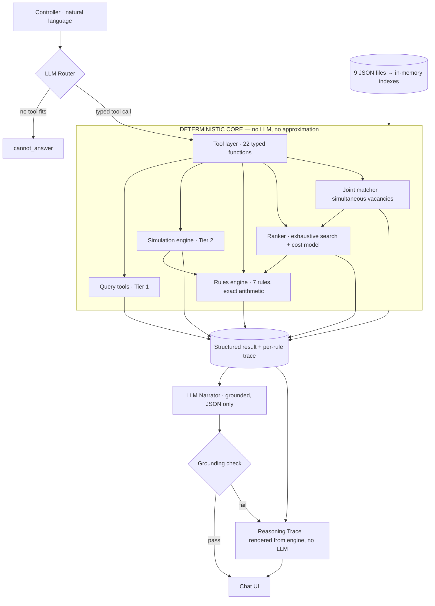

# Crew Ops Advisor — dCortex Agentic Crew Ops Advisor

A conversational advisor for an airline Crew Control desk. Ask in plain English; get an
answer that is **arithmetically correct**, **rule-cited**, and **auditable line by line**.

```
Controller:  Captain C-1042 called in sick for 15 Sep. What should I do?

Advisor:     6 legs uncrewed (DX412/413/588 on 15 Sep, DX589/590/591 on 16 Sep),
             pairing P-2291 broken, 972 passengers exposed.

             1. Reserve C-3310 — ₹18,500, no delay. BLR-based, A320-rated,
                on-call 06:00–18:00Z, reachable in 45 min. All 7 rules pass.
             2. Day-off callout C-3983 — ₹24,000, no delay.
             3. Deadhead C-2210 from DEL — ₹41,200, 3h delay to DX412.

             Not C-2087: RULE-DUTY-02, would exceed 60h/7d by 1h20m (61.33h).
             Cancelling costs ₹1,500,000.
```

**Verified: 37/37 machine-scorable questions and 6/6 scenarios against the published
answer keys.** Run `python3 -m eval.run_eval --engine` to reproduce.

---

## The architecture decision

The problem statement asks the real question outright: *what should the LLM do, and what
should deterministic code do?*

> **The LLM is a translator and a narrator. It never computes.**
> A deterministic rules engine is the only source of truth for legality, cost and ranking.

The LLM has exactly three jobs:

| Job | Input | Output |
|---|---|---|
| **Route** | controller's message + tool schemas | `check_assignment(crew_id="C-2087", pairing_id="P-2291")` |
| **Narrate** | the engine's JSON, and nothing else | "C-2087 would exceed the 7-day duty limit by 1h20m." |
| **Refuse** | a question no tool answers | "I can't determine that from the crew ops data." |

Two mechanisms make this more than a claim:

1. **The narrator never sees the dataset.** It is handed one JSON object — the engine's
   output for this question. It cannot name a crew member it wasn't given, because it
   has never seen the roster.
2. **A grounding check runs after generation.** Every `C-####`, `DX###`, `RULE-*` and
   numeric token in the narration is matched against the engine output. On a mismatch
   the prose is discarded and the raw rule trace is shown instead. See
   `agent.grounding_violations`.

The **Reasoning Trace** panel in the UI bypasses the LLM entirely — rule ID, the numbers,
the limit, pass/fail, rendered straight from the engine. If the narrator ever drifts,
the trace still shows the truth.



---

## Setup

### Windows PowerShell

From the project directory:

```powershell
cd "C:\Users\LENOVO\Documents\DCortex\crew-ops-advisor"

# Install/update dependencies in the project virtual environment
.\.venv\Scripts\python.exe -m pip install -r requirements.txt

# Validate the supplied dataset
.\.venv\Scripts\python.exe validate.py

# Run the deterministic evaluation (no API key required)
.\.venv\Scripts\python.exe -m eval.run_eval --engine
```

To run the chat UI with Sarvam:

```powershell
$env:DCORTEX_PROVIDER="sarvam"
$env:SARVAM_API_KEY="PASTE_YOUR_SARVAM_KEY_HERE"
$env:DCORTEX_MODEL="sarvam-105b-conversations"

.\.venv\Scripts\streamlit.exe run app\ui.py
```

Open `http://localhost:8501` in a browser. The Sarvam adapter uses
`https://api.sarvam.ai/v1` by default. Never commit or paste an API key into
the repository; rotate any key that has been exposed.

To run the CLI instead:

```powershell
.\.venv\Scripts\python.exe -m app.agent "who is on reserve at BLR tomorrow?"
```

### Linux/macOS

```bash
python3 -m venv .venv && source .venv/bin/activate
pip install -r requirements.txt

# dataset: data/*.json  (9 files, as shipped)
python3 validate.py                    # dataset consistency check

# Anthropic example
export ANTHROPIC_API_KEY=sk-ant-...
export DCORTEX_PROVIDER=anthropic
export DCORTEX_MODEL=claude-sonnet-4-6

# OpenAI-compatible example (also accepts openai/gpt-oss-120b as one value)
export OPENAI_API_KEY=sk-...
export OPENAI_BASE_URL=https://your-openai-compatible-endpoint/v1
export DCORTEX_MODEL=openai/gpt-oss-120b

# Sarvam example
export DCORTEX_PROVIDER=sarvam
export SARVAM_API_KEY=your-sarvam-key
export DCORTEX_MODEL=sarvam-105b-conversations
# The app defaults Sarvam to https://api.sarvam.ai/v1.

python3 -m eval.run_eval --engine      # 37/37 · no API key needed
streamlit run app/ui.py                # the demo
python3 -m app.agent "who is on reserve at BLR tomorrow?"   # CLI
```

The flight schedule dataset covers `2026-09-14` through `2026-09-20`.
Duty history may contain earlier dates, but flight-level queries outside the
schedule range are reported as unavailable rather than as zero flights.

## Layout

```
app/
  data.py             load 9 JSON files, build indexes                (no LLM)
  rules.py            the 7 legality rules, exact arithmetic          (no LLM)
  simulate.py         Tier-2 consequence engine                       (no LLM)
  recommend.py        Tier-3 exhaustive ranking + cost model          (no LLM)
  recommend_joint.py  min-cost matching for simultaneous vacancies    (no LLM)
  tools.py            22 typed tools — the LLM/deterministic boundary
  agent.py            router, narrator, grounding check               (LLM)
  ui.py               Streamlit chat + reasoning trace
eval/run_eval.py      scores against questions.json + scenarios.json
docs/failure_analysis.md
```

---

## Key trade-offs

**No SQL tool, no free-form query.** The 22 tool signatures are fixed. The LLM chooses
*which* question to ask, never *how* to ask it. It gives up flexibility on long-tail
lookups — a question outside the 22 tools gets `cannot_answer` — and buys the guarantee
that a well-formed tool call cannot be a wrong query. On a Crew Control desk that is the
right side of the trade.

**No RAG, no vector DB.** 147 flights and 150 crew fit in memory in ~5 ms. Retrieval over
a dataset this size is a solved problem called a dict. Semantic retrieval would introduce
recall failure into a domain where a missed crew member is a cancelled flight.

**No framework.** Raw Anthropic tool-use, ~150 lines in `agent.py`. LangChain would have
hidden the exact boundary this system is built around.

**Exhaustive search, not optimisation.** `rank_options` evaluates all 150 crew against all
7 rules per candidate — ~2 ms. It is provably complete and every rejection carries a
readable reason. A solver would be faster and unauditable; a controller cannot challenge
a simplex tableau at 06:00.

**Equal-cost ties.** The answer keys order equal-cost options by `crew_id`; we order by
reachability, then seniority. The dataset README states equal-cost plans are equally
correct, so the eval compares cost *tiers*, not exact ordering. Reachability is the
operationally useful tie-break — it is the number that decides whether the flight goes.

---

## Dataset findings

Seven things that silently produce fluent, confident, wrong answers:

1. **`certifications.valid_from` is unreliable** — licence records carry future or inverted
   issue dates (C-1042: `valid_from` 2030-01-24). Only `valid_to` is operative for
   RULE-CERT-06. Enforcing `valid_from` flags all 150 crew as illegal.
2. **RULE-REST-04 is bidirectional.** Rest must be checked against the crew's *next*
   rostered duty, not only `last_rest_ended`. Q28 (C-5837) is only catchable this way:
   10h45m before P-2204 on 17 Sep. Miss it and the ranker recommends illegal crew.
3. **`last_rest_ended` means rest has ended** — an availability timestamp, not the start
   of a 12h countdown.
4. **7d/28d windows are calendar-day, inclusive of the duty date.** Use `daily_history`,
   never the `duty_hours_7d` summary field — that is pinned to the 14 Sep snapshot and is
   silently wrong on every other day.
5. **Future rostered duties are not in `daily_history`** (it ends 14 Sep). Window sums
   merge three sources in priority order: proposed duty → existing future roster →
   history, excluding the pairing being vacated.
6. **Deadhead positioning is only documented DEL→BLR** (DX402 arr 08:45Z odd dates,
   DX589 arr 07:45Z even; new report = arrival + 15 min). Other pairs return
   "not modelled" rather than an invented connection.
7. **Reserve on-call windows are tested against the required report time**, not the
   callout time. C-3305's 00:00–05:30 window against a 06:00 report is a real exclusion.

---

## Crew PII in production

The dataset is synthetic; a production deployment handles real crew data under DGCA and
GDPR obligations.

- **The LLM sees identifiers, never identities.** `crew_id` is the only crew reference
  that enters a prompt or a log. Names, contact details and addresses stay in the data
  layer and are resolved client-side for display. This is already how the code works —
  `agent.py` passes engine JSON, and engine JSON carries IDs.
- **Certification and medical records are the sensitive tier.** Field-level encryption at
  rest, separate key custody from the operational store, and access scoped to the legality
  check — the engine needs "valid on date", not the diagnosis.
- **Every recommendation is logged with its full rule trace**, retained for regulatory
  review. That audit log is a byproduct of the explainability design, not extra work.
- **Data residency**: Indian crew data stays in-region; the LLM call carries only IDs and
  computed numbers, so cross-border inference is possible without cross-border PII.
- **Prompt and completion logging is scrubbed** of identifiers before leaving the VPC.
- **Reachability and contact data** are the highest-risk fields for misuse (they reveal
  where a person is). Access is per-callout and time-boxed, not a browsable directory.

## Scalability

The boundary is what scales, not the storage.

At real carrier scale — 300 aircraft, 15,000 crew, 3,000 daily legs:

- **Storage**: JSON → Postgres. Indexes on `(crew_id, duty_date)`, `(base, rank, rating)`,
  `(aircraft, date)`. The duty-window sum becomes a materialised rolling aggregate rather
  than a per-request scan.
- **The ranker is the hot path.** Candidate enumeration goes from 150 to 15,000. Pre-filter
  on base + rating + roster-free + rank *before* rule evaluation, which cuts the set to
  ~50 realistic candidates (O(n) → O(k)). Rule evaluation is per-candidate and
  embarrassingly parallel.
- **Cache duty-window sums per `(crew_id, date)`**, invalidated on roster change. This is
  the single most-repeated computation in the system.
- **LLM cost is flat in fleet size.** Because no data enters the prompt, a 15,000-crew
  airline and a 150-crew airline cost the same per turn. That is the compounding benefit
  of keeping the dataset out of the context window — and it is why the RAG approach gets
  more expensive exactly as it gets less reliable.
- **The rules engine is stateless**, so horizontal scaling is trivial. State lives in
  Postgres and the roster-change stream.

## Known limitations

See `docs/failure_analysis.md` for the worked failure case. In brief:

- **Station-closure recovery is detection, not planning.** We identify every affected leg
  and pairing correctly, but do not compute per-flight minimum delay, the resulting FDP,
  or the re-crew decision. This is the documented failure case.
- **No aircraft-rotation cascade.** A delay is modelled within a duty, not propagated down
  the tail's subsequent legs or into other pairings.
- **Deadhead routes limited** to the documented DEL→BLR legs.
- **Cabin-crew complement** is modelled by role count, not by minimum-complement rules
  that would allow a reduced-capacity dispatch.
- **`valid_from` ignored** on certifications by necessity (see finding 1).
- **No passenger connections or misconnect cost** — `passengers_affected` is seat count.
